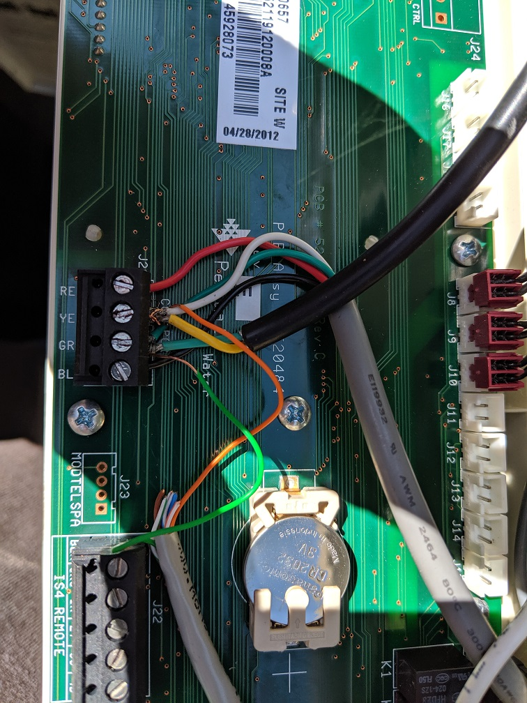
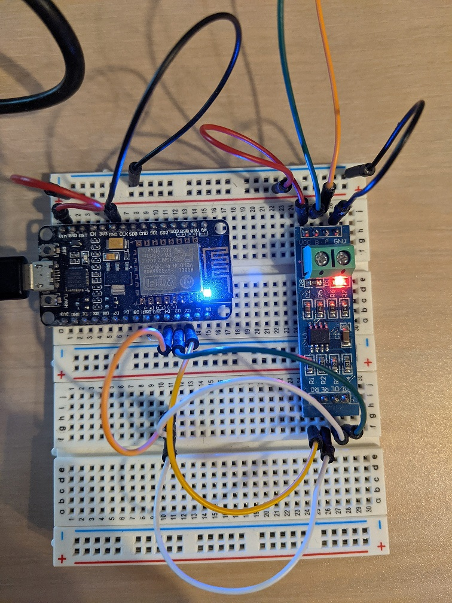

# Introduction

This is an attempt at build a wireless pentair pool remote application (acting like a pentair wireless remote) based on an arduino (esp8266), controlled over WIFI. The connection to the pentair controller is done via an rs485 serial bus add-on board. Once connected on the bus, the arduino controller reads/writes the bus protocol to read/control what the pool components are doing.

There are many other controller projects out there, but many are based on raspberry PI (in python or node), which seems overkill. I heavily rely on these other projects to understand how the pentair system functions and being able to decode the protocol. I would've gone nowhere withtout those, so thanks to all of them, they are listed under the References section.

# Pool equipment

This lists the pool equipment I have, as it appears that what each project does is very dependent on their own equipment.

- Easytouch control center
- Intelliflow VS Pump
- Intellichlor IC40 chlorinator
- Spa
- Spa Bubble Blower
- Gas Heater (used for the spa)
- Solar Heater (used for the pool)
- Sweep Cleaner - Polaris 280, with booster pump

I do not own a remote, which makes it impossible to analyze the protocol it is exchanging with the control center; so for that I'll need to rely on online resources.

# Hardware Setup

I have installed a cat5 cable, plugged into the RS485 connector (orange and green only) inside the easytouch control center:

 

And on the other side, that cable lands onto the RS485 board, which connect to an ESP8266:

# How to Build

back in 2018, I really wanted to be able to run unit tests on this project, as the encoding/decoding of protocol packets can be tricky. Running tests quickly is important, so I went out to look for a solution that would run tests locally (as opposed to onboard the arduino). I stumbled on Sloeber, which does just that and also support running tests under the google test framework, which I'm familiar with.

After a long pause, fast forward to 2021 and there are now many options that allow to run unit tests, such as AUnit and PlatformIO, and I'm sure many others. But these would require significant changes in the code (how tests are written for platform IO) and/or the workflow (using EpoxyDuino for AUnit), so I'm sticking with Sloeber.

I don't love Sloeber, as it is fairly picky and finicky and not really maintained anymore, but it seems to work.
The main constraint here is that it is only possible to run local unit tests on code that does not depend on anything else than Arduino.h. This forces to split the code into "pure c++" (including Arduino.h for ctypes) and hardware dependent code. To achieve that, I have split the code in 3 directories:

- src contains the "pure unix" code (which is really most of the logic I care about testing)
- test contains the unit tests for what's in src
- pentair contains the hardware dependent code and does not have unit tests.

I build this with Sloeber using 2 different projects:

- pentair_tests: imports sources from src & tests; uses a unit tests / platform 1.0.2 configuration
- pentair_sketch: imports source from src and pentair; uses a Release / esp8266 configuration

# References

This section lists the online references I have found and used online.

Many thanks to all these people for making this available.

## tagyoureit - Javascript - 2016-2021

Has the most complete code out there and still being developped.

https://github.com/tagyoureit/nodejs-poolController

protocol is documented in the wiki:

https://github.com/tagyoureit/nodejs-poolController/wiki

## scottrfrancis - Python - 2020

Pi/Python controller

https://github.com/scottrfrancis/Pentair-Thing

## sdyoung - Arduino - 2015

Good intro to the protocol. Few things don't match my setup.

https://web.archive.org/web/20170401002023/http://www.sdyoung.com/home/decoding-the-pentair-easytouch-rs-485-protocol/

Note: the `18` 'magic value' referenced in the intellichlor protocol section is simply the packet header (`0x1a + 0x02`).

and overall system setup:

https://web.archive.org/web/20170401003443/http://www.sdyoung.com/home/pool-status/how-i-control-the-pool/

 [copied here.](docs/sdyoung)

## Zuntara - Arduino - 2017

https://github.com/Zuntara/Arduino.Pentair

This is a controller for an intelliflow pump, to replace an easy touch control center.

## Josh Block - Protocol Documentation

https://docs.google.com/document/d/1M0KMfXfvbszKeqzu6MUF_7yM6KDHk8cZ5nrH1_OUcAc/edit

Nicely documented protocol description.

## Misterhouse - Perl - 2006

https://github.com/brad/Misterhouse/blob/master/lib/Compool.pm

Serial port control & status.

## dminear - Python - 2014

Very detailed description of protocol to send commands, apparently copied from http://forum.cinemaronline.com/viewtopic.php?p=89446. Unfortunately, the data bytes of the packets don't seem ot match what I am seeing.

https://github.com/dminear/easy-touch-raspberry-pi/blob/master/src/005_reference/protocol.txt

Based on Misterhouse.

## Michael Russee - C - 2010

 https://github.com/ceesco53/pentair_examples

 good protocol definition; focus on sending commands. Sadly, shows the downside of using short abbreviated variable names: it is impossible to figure out what most things are by reading the code.

 no longer available online. [code copied here.](docs/pab014share)

## The Hook Up - Arduino - 2018

 https://github.com/thehookup/PoolMCU

 Simulates the button presses of the pool side remote with an arduino triggering optocouplers. No hook up to the easytouch controller nor the bus.

## Michael Usner - Javascript - 2016

https://github.com/michaelusner/Home-Device-Controller
